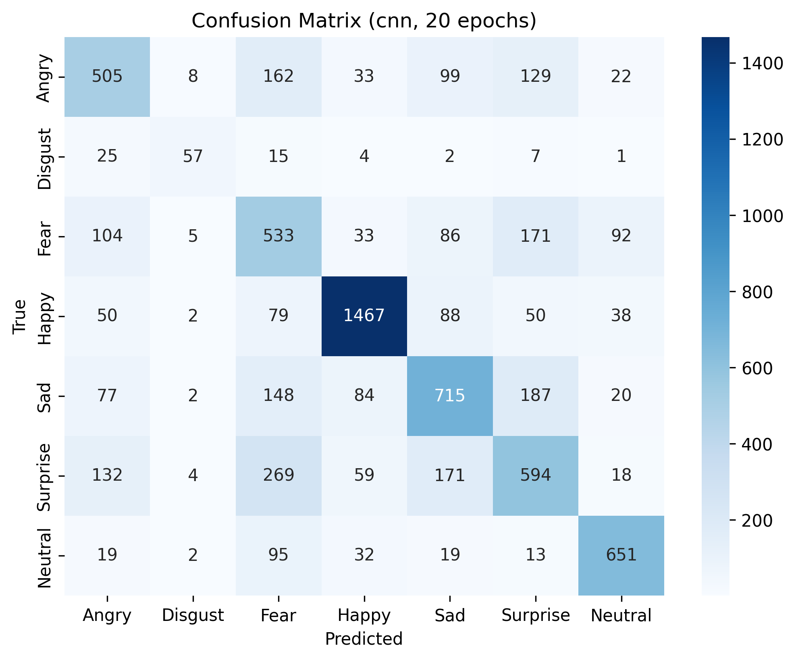
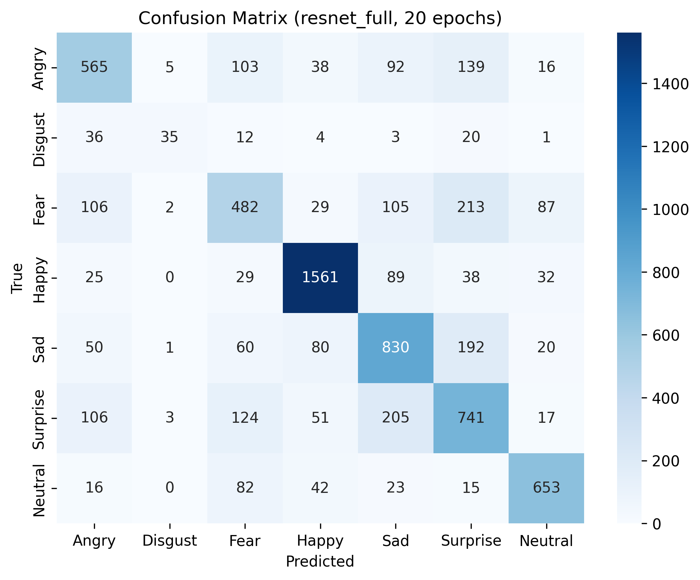

# ENSF 519 - Final Project
*Due: 12/05/2025*

| Student | UCID |
| ----------- | ----------- |
| Aidan Huang | 30149948 |
| Jin Kim | 30173509 |
| Rohan Lange | 30181306 |

## Problem We Are Trying To Solve
Welcome to our ENSF 519 Final Project! We have been tasked by Meta (not actually) to develop a prototype ML model for facial emotion classification. This is in an effort to improve Meta's Instagram/Facebook selfie filter performance.

## Dataset Description
The dataset used for training can be accessed through:
[FER-2013 Kaggle Dataset](https://www.kaggle.com/datasets/msambare/fer2013)

This dataset was chosen because:

1. 700+ community posts using and testing this dataset with results
2. 48x48 pixel images allow for quick downloads
3. Comes pre-split into training and testing splits

## What Models We Used To Solve The Problem
1. Custom CNN
    - Designed for 48x48 images
    - Consist of 3 convolutional blocks (Conv -> BatchNorm -> ReLU -> Maxpool)
    - 2 fully connected layers
    - Regularization (dropout, data augmentation)
    - Full control over hyperparams

Foundational model as a baseline to understand performance.

2. Pre-trained ResNet18
    - Deep CNN pre-trained on ImageNet (1.2 Million Images, 1000 classes) with 224x224 RGB images
    - Has a total of 18 layers totaling up to 11.7 Million Parameters
    - Residual connections to solve vanishing gradient problem and ensures stable training
    - 3 Modes: 
        - FC ONLY: Fully Connected Layer with all Convolutional Layers Frozen
        - Layer4 + FC: Unfroze last residual block for trade-off between accuracy and training time
        - Full Fine-Tuning: Unfroze ALL layers to allow for deep adaptation to grayscale FER-2013 faces 


## Our Results
Test Accuracy
| Model	| Test Accuracy |
|------------|------------|
| Custom CNN | ~0.63 |
| ResNet18 | ~0.67 |
### Confusion Matrix — Custom CNN


### Confusion Matrix — ResNet18 (Layer4 Fine-Tuning)

# General Observations

ResNet18 consistently outperformed the Custom CNN by ~4% due to stronger pretrained feature extraction and deeper architectural capacity.
The improvement, while modest, demonstrates the value of transfer learning, especially on smaller grayscale datasets like FER-2013.
Training times for ResNet were slightly longer, but still manageable thanks to partial fine-tuning and Cuda taking on average 20 seconds per epoch.

# Confusion Matrix Insights

Across both models, the confusion matrices revealed similar patterns:
Angry, Fear, and Surprise are frequently misclassified as one another.
Sad is often confused with Fear or Surprise.
Happy is typically the easiest class, showing high recall in both models.
Disgust is the worst-performing class (very common for FER-2013), likely due to:
    - low sample count
    - visual similarity to anger
    - dataset imbalance
These patterns align with known limitations of the FER-2013 dataset and prior research on facial emotion recognition.

## Interpretation Of Our Results
The results indicate that while our models can recognize basic facial emotions with moderate accuracy, several challenges remain:

1. Subtle Emotions Are Difficult to Distinguish

    - Emotions like Fear, Surprise, and Anger share overlapping facial features—raised eyebrows, widened eyes, tense mouths—making them hard to separate in low-resolution (48×48) grayscale images. This explains the consistent confusion between these categories across both CNN and ResNet.

2. Dataset Limitations Impact Performance

    - FER-2013 is a widely used but noisy dataset with:
    - uneven class distribution
    - limited representation of real-world faces
    - low image resolution

These factors cap the achievable accuracy, even with strong models.

3. Transfer Learning Helps, But Only So Much

- ResNet18’s slight performance edge (+4%) shows the benefit of pretrained representations. However, the gap is not huge because:

    - ImageNet pretraining uses RGB images, whereas FER-2013 is grayscale
    - The emotional cues are subtle and dataset-specific
    - The resolution mismatch (224 → 48 px) limits transferability

4. Practical Takeaway

- Both models perform adequately for prototype facial-expressions recognition software, but they should not be used in any high-stakes or real-world setting without major improvements such as:
    - larger and more diverse training data
    - higher-resolution facial crops
    - better class balancing
    - more advanced models (e.g., Vision Transformers, EfficientNet)

## Any Deviations From Proposal?
The only deviation from our proposal was excluding a dedicated front-end layer to maximize simplicity and reduce our scope during development. All other aspects of our project closely match our written proposal.

## Ethical Concerns?
**Ethical Concern 1 - Privacy**

Facial emotion recognition inherently involves analyzing sensitive biometric data.

*Potential issues include:*
 - Unauthorized coll ection or storage of facial images
 - Misuse in surveillance systems without user consent
 - Risk of re-identification if model outputs are linked back to individuals

*Mitigation strategies:*
 - Ensure all training data is publicly available and anonymized
 - Do not store user images locally or on servers
 - Avoid linking predictions to identifiable personal information

**Ethical Concern 2 - Bias**

Emotion datasets often contain uneven representation across demographics such as age, ethnicity, or gender.

*Potential:*
 - Unequal model performance across population subgroups
 - Stereotyping or misclassification of certain demographics
 - Potential harm if deployed in sensitive contexts (e.g., hiring, policing)

*Mitigation strategies:*
 - Acknowledge dataset limitations (e.g., FER-2013’s demographic imbalance)
 - Avoid deploying the model in real-world decision-making
 - Evaluate model performance across different categories where possible

**Ethical Concern 3 - Environmental**

Training deep learning models consumes computational resources and electricity, contributing to CO₂ emissions.
Although our models are relatively lightweight, large-scale facial analysis is environmentally costly.

*Mitigation strategies:*
 - Use transfer learning (as we did) to reduce compute time
 - Avoid unnecessary retraining
 - Run training on efficient hardware (e.g., GPUs) to minimize wasted energy

## How To Run
**Step 1 - Initialization**

Ensure your computer or environment has the following:
```
python --version: 3.10 or higher
```

>*Note: Model training time is significantly shorter if your device is using a supported **Nvidia GPU**.*


**Step 2 - Running Application**

Navigate to the `/src` directory:
```
cd src
```

Run the `moodify.py` application:
```
python moodify.py
```

**Step 3 - Moodify**

You will be able to select the model, re-train the models, and run an inference with your own desired images.